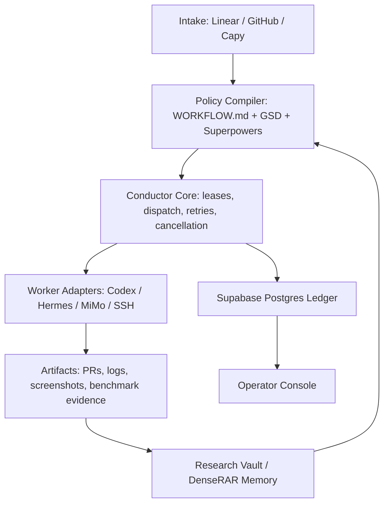

# Evensong-Conductor Design

Date: 2026-04-28
Status: approved direction, foundation scope
Source: fork of `openai/symphony`

## Purpose

Evensong-Conductor turns Symphony from an engineering preview into our own agent operations layer: a durable control plane for Linear/GitHub work, Codex/Hermes/MiMo workers, GSD phase execution, Superpowers policy checks, and Research Vault memory.

The goal is not to make another chat UI. The goal is to make autonomous work observable, interruptible, resumable, and evidence-backed.

## Product Boundary

Evensong-Conductor owns orchestration and evidence. It should not own every worker implementation.

It coordinates:

- work intake from Linear, GitHub, and later Capy
- isolated local and remote workspaces
- worker sessions for Codex, Hermes, MiMo, and future backends
- durable run state, event logs, artifacts, and token/accounting history
- policy packs built from GSD, Superpowers, repo `WORKFLOW.md`, and project-specific skills
- memory and retrieval handoffs through Research Vault and DenseRAR-backed evidence

It does not replace:

- Codex app-server
- Hermes Agent
- MiMo API
- Linear or GitHub
- Research Vault MCP
- GSD planning artifacts

Those remain independent systems with explicit adapters.

## Relationship To Upstream Symphony

This repository stays forked from `openai/symphony`.

The current upstream Elixir implementation remains the reference runner. We should not delete or rewrite it before a replacement has behavior parity. Upstream sync stays useful, so all Evensong-specific work should be additive and clearly namespaced.

Rules:

- `origin` is `Fearvox/Evensong-Conductor`.
- `upstream` is `openai/symphony`.
- `upstream` push remains disabled.
- Keep upstream files readable and minimally disturbed.
- Put Evensong product docs, adapters, and new code in explicit Evensong paths.

## Architecture Direction

The target architecture has four layers.

### 1. Reference Runner Layer

The existing Elixir app remains useful because it already solves real orchestration problems:

- Linear polling
- per-issue workspaces
- Codex app-server execution
- retry and continuation loops
- Phoenix observability
- SSH worker support
- token accounting

Short term, we harden and wrap this implementation instead of discarding it.

### 2. Durable Ledger Layer

Supabase Postgres becomes the durable state and audit layer.

It stores facts, not secrets:

- work items and normalized external IDs
- run sessions and attempts
- worker leases and heartbeats
- event stream entries
- artifact references
- model usage snapshots
- policy version hashes
- memory snapshot references

It should not store API keys, raw private prompts, local absolute paths, private IPs, or unredacted terminal output.

### 3. Conductor Core Layer

Rust is the target language for the long-term core because the core needs strong process control, typed state transitions, portable binaries, and reliable local/remote supervision.

The Rust core should first ship as an additive sidecar:

- read/write Supabase ledger state
- supervise worker commands
- enforce leases and cancellation
- expose a local HTTP API
- interoperate with the existing Elixir reference runner

Only after parity should it replace Elixir as the primary scheduler.

### 4. Operator Console Layer

The console is a real product surface, not a decorative dashboard.

It should show:

- active work queue
- running sessions
- worker health
- token and context-window usage
- retries and stuck runs
- artifacts and PR links
- memory snapshots and retrieval evidence
- one-click copy commands for tmux, SSH, portless, and worker prompts

Visual direction:

- light mode: super-light Helvetica/SF-style typography, white panels, thin dividers
- dark mode: same information density, not a glow-heavy terminal clone
- animation should explain state transitions, not decorate them

## State Model

The first durable schema should include these tables.

### `conductor_projects`

One row per repository or product line.

Key fields:

- `id uuid primary key`
- `slug text unique not null`
- `name text not null`
- `repo_url text not null`
- `default_branch text not null default 'main'`
- `created_at timestamptz not null default now()`

### `conductor_work_items`

Normalized Linear/GitHub/Capy tasks.

Key fields:

- `id uuid primary key`
- `project_id uuid not null references conductor_projects(id)`
- `source_kind text not null`
- `source_id text not null`
- `source_identifier text not null`
- `source_url text`
- `title text not null`
- `state text not null`
- `priority int`
- `labels text[] not null default '{}'`
- `payload_redacted jsonb not null default '{}'`
- `created_at timestamptz not null default now()`
- `updated_at timestamptz not null default now()`

Unique key: `(source_kind, source_id)`.

Indexes:

- `(project_id, state, priority, updated_at desc)`
- `gin(labels)`

### `conductor_runs`

One logical execution run for a work item.

Key fields:

- `id uuid primary key`
- `work_item_id uuid not null references conductor_work_items(id)`
- `status text not null`
- `policy_hash text not null`
- `workspace_key text not null`
- `started_at timestamptz not null default now()`
- `ended_at timestamptz`
- `failure_reason text`

Indexes:

- `(work_item_id, started_at desc)`
- `(status, started_at desc)`

### `conductor_run_attempts`

One worker attempt inside a run.

Key fields:

- `id uuid primary key`
- `run_id uuid not null references conductor_runs(id)`
- `attempt_number int not null`
- `worker_kind text not null`
- `worker_id text`
- `model text`
- `status text not null`
- `started_at timestamptz not null default now()`
- `ended_at timestamptz`
- `error_summary text`

Unique key: `(run_id, attempt_number)`.

### `conductor_workers`

Known local and remote workers.

Key fields:

- `id uuid primary key`
- `name text unique not null`
- `kind text not null`
- `host_label text not null`
- `capabilities text[] not null default '{}'`
- `status text not null default 'unknown'`
- `last_heartbeat_at timestamptz`

Indexes:

- `(status, last_heartbeat_at desc)`
- `gin(capabilities)`

### `conductor_worker_leases`

Lease rows prevent two schedulers from owning the same worker or item.

Key fields:

- `id uuid primary key`
- `worker_id uuid not null references conductor_workers(id)`
- `run_attempt_id uuid references conductor_run_attempts(id)`
- `lease_key text not null`
- `expires_at timestamptz not null`
- `created_at timestamptz not null default now()`

Indexes:

- `(lease_key, expires_at)`
- `(worker_id, expires_at)`

### `conductor_events`

Append-only event stream.

Key fields:

- `id bigserial primary key`
- `run_id uuid references conductor_runs(id)`
- `run_attempt_id uuid references conductor_run_attempts(id)`
- `event_type text not null`
- `severity text not null default 'info'`
- `message text not null`
- `payload_redacted jsonb not null default '{}'`
- `created_at timestamptz not null default now()`

Indexes:

- `(run_id, id)`
- `(run_attempt_id, id)`
- `(event_type, created_at desc)`

### `conductor_artifacts`

References to evidence artifacts.

Key fields:

- `id uuid primary key`
- `run_id uuid references conductor_runs(id)`
- `kind text not null`
- `label text not null`
- `uri text not null`
- `sha256 text`
- `redaction_level text not null default 'public-safe'`
- `created_at timestamptz not null default now()`

Indexes:

- `(run_id, kind, created_at desc)`

### `conductor_model_usage`

Token and context accounting.

Key fields:

- `id uuid primary key`
- `run_attempt_id uuid not null references conductor_run_attempts(id)`
- `provider text not null`
- `model text not null`
- `input_tokens bigint not null default 0`
- `output_tokens bigint not null default 0`
- `total_tokens bigint not null default 0`
- `context_window bigint`
- `recorded_at timestamptz not null default now()`

Indexes:

- `(run_attempt_id, recorded_at desc)`
- `(provider, model, recorded_at desc)`

## Supabase Rules

The schema follows these rules:

- use narrow indexes for scheduler queries
- use append-only events for run history
- keep secrets outside Postgres
- use `jsonb` only for redacted external payloads, not for core relational state
- use service-role access for workers initially
- add RLS when the operator console has user auth
- avoid long transactions around agent execution
- use leases with expiration instead of holding database locks during work

## Policy Compiler

Every run should compile an explicit policy pack before execution.

Inputs:

- upstream `WORKFLOW.md`
- repo `AGENTS.md`
- GSD phase/spec/plan guidance
- Superpowers skill requirements
- project-specific skills
- Research Vault memory summary
- worker-specific limits

Output:

- stable policy hash
- rendered run prompt
- allowed tools
- workspace root
- expected validation gates
- redaction rules

This hash is stored with `conductor_runs.policy_hash` so future audits can reconstruct which instruction contract produced a run.

## Worker Adapter Contract

Each worker adapter must implement the same lifecycle.

Required operations:

- `prepare_workspace`
- `start_session`
- `send_turn`
- `stream_events`
- `cancel`
- `collect_artifacts`
- `summarize_result`

Required event types:

- `worker.started`
- `worker.heartbeat`
- `turn.started`
- `turn.output`
- `turn.completed`
- `turn.failed`
- `usage.updated`
- `artifact.created`
- `run.blocked`
- `run.completed`

Adapters should be replaceable. A Linear issue should not care whether the worker is Codex app-server, Hermes in tmux, MiMo through an OpenAI-compatible endpoint, or an SSH-hosted runner.

## Memory And Retrieval

Research Vault remains the memory system. Evensong-Conductor should reference memory snapshots instead of copying raw private content into the ledger.

DenseRAR evidence should be treated as benchmark-backed retrieval capability, not as a universal claim. Public claims should stay bounded to the verified hard-suite runs.

Memory integration modes:

- pre-run: attach compact memory summary and retrieval hits
- mid-run: allow explicit lookup through MCP
- post-run: write a short memory handoff artifact
- audit: connect completed work to evidence and benchmark artifacts

## Failure Handling

Required failure paths:

- context-window pressure: summarize, checkpoint, and start a continuation run instead of silent downgrade
- output truncation: switch worker prompt to compact final reporting mode
- worker stall: heartbeat timeout, cancel, preserve workspace, retry with backoff
- auth missing: mark blocked with exact missing auth name, not broad failure text
- dirty workspace: preserve diff, record status, and avoid destructive cleanup
- upstream sync conflict: stop before rewriting upstream-owned code

## First Implementation Slice

The first real implementation slice should build the durable foundation, not the whole product.

Included:

- Supabase schema for projects, work items, runs, attempts, workers, leases, events, artifacts, and usage
- local Rust workspace for conductor core types and ledger access
- seed CLI command to inspect ledger health
- docs connecting Symphony Elixir to Evensong-Conductor

Excluded from first slice:

- full operator console
- Capy adapter
- autonomous merge/land behavior
- replacement of Elixir orchestrator
- public deployment

## Success Criteria

The foundation is successful when:

- a developer can run local Supabase
- migrations create the core tables and indexes
- Rust core can connect to the database and insert/read a test event
- Elixir reference runner remains untouched and runnable
- docs explain how upstream Symphony, Rust core, and Supabase state relate
- no secrets, private endpoints, or machine-specific paths are committed

## Design Self-Review

- No placeholder requirements remain.
- Scope is intentionally limited to a foundation slice.
- The architecture keeps upstream sync possible.
- Supabase is used for durable state, not as a blocking lock manager.
- Rust is selected as the target core without forcing an immediate risky rewrite.
- The design has explicit non-goals to avoid becoming another unbounded agent demo.
